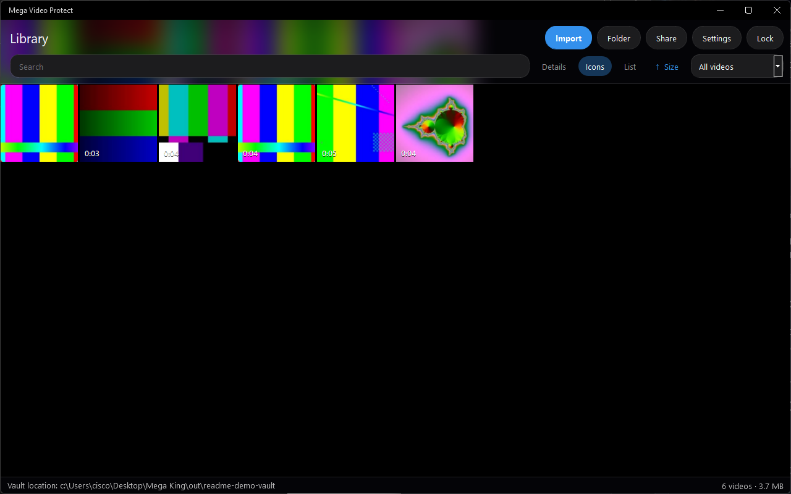
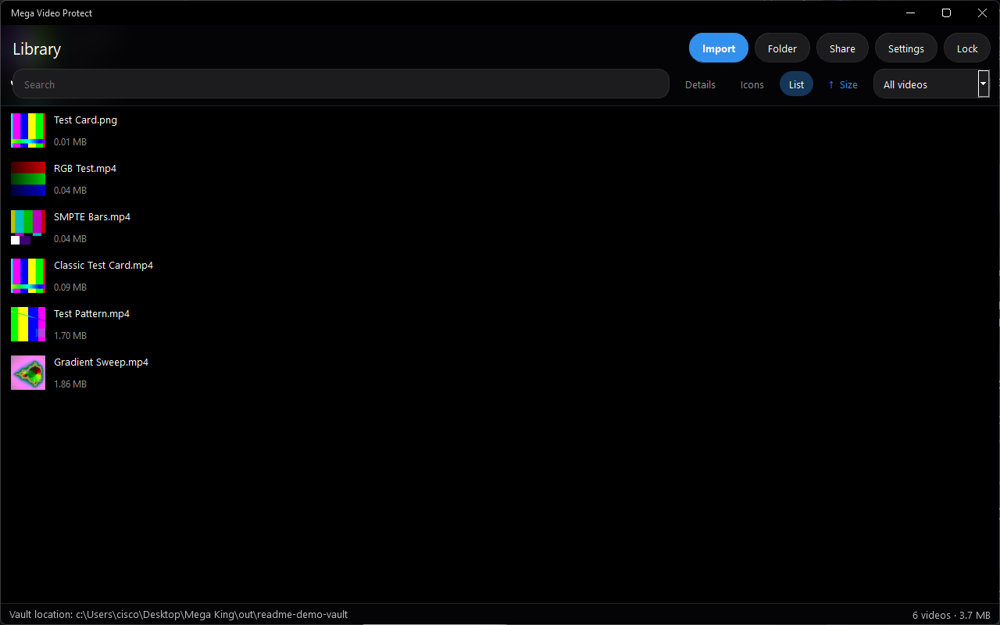
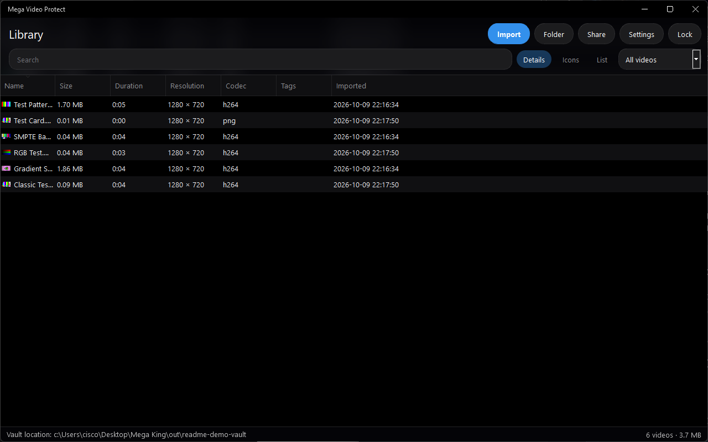
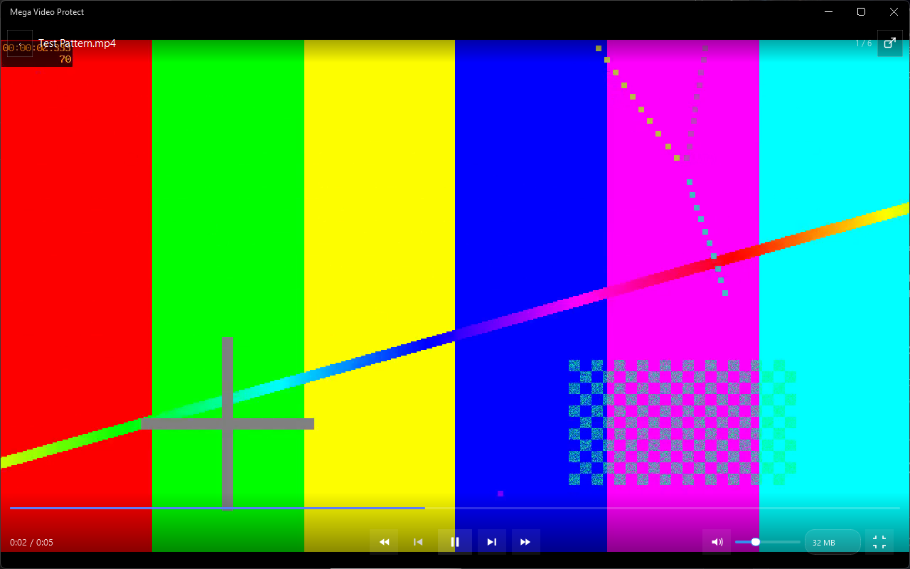
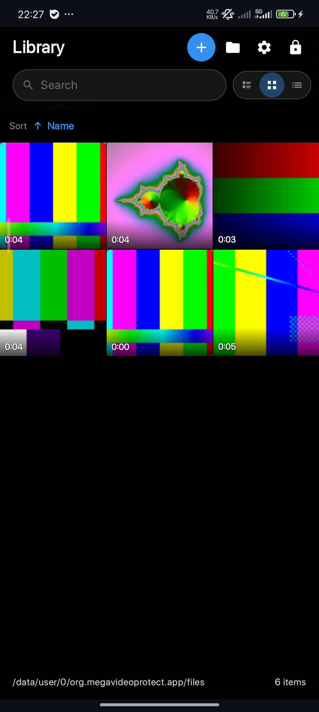
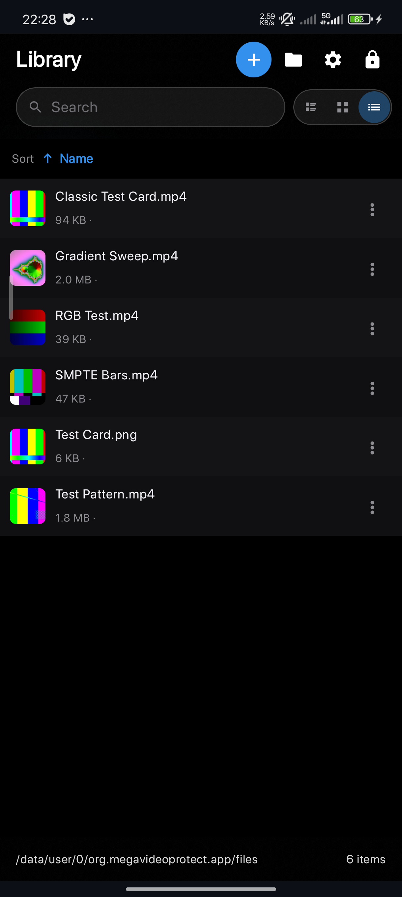
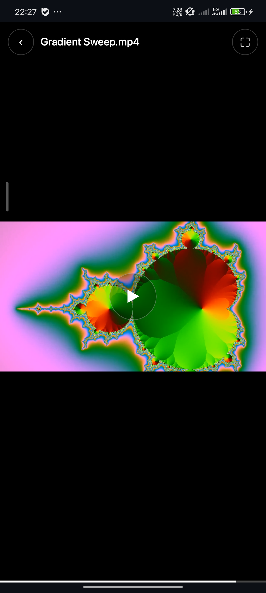

<div align="center">


# Mega Video Protect

<p align="center">
  
</p>

[](https://en.cppreference.com/w/cpp/20)
[](https://www.qt.io/)
[](https://kotlinlang.org/)
[](https://www.zetetic.net/sqlcipher/)
[](https://en.wikipedia.org/wiki/Argon2)
[](https://doc.libsodium.org/)
[](https://ffmpeg.org/)
[](https://cmake.org/)

</div>

---
<div align="center">

[]() &nbsp;
[]() &nbsp;
[]()

**[Features](#features)** · **[Screenshots](#screenshots)** · **[Downloads](#downloads)** · **[Tests](#tests)** · **[Security model](#security-model)** · **[Build & run](#build--run)**

</div>

**Your private video vault — encrypted on your machine, playable without ever decrypting to disk.**

Mega Video Protect is a video organizer that treats privacy as the default. Every video you import is split into authenticated, encrypted packages stored inside a vault locked by a password you choose; nothing leaves your computer. The app plays back your videos **in memory** through a streaming, tamper-checked reader — the plaintext never touches your disk. The same C++ core powers a **native Android app** (Kotlin/Jetpack Compose) whose UI mirrors the desktop client exactly, with the core exposed through a JNI bridge.

## Features

- 🔐 **Real encryption, not hiding.** Argon2id key derivation, an SQLCipher-encrypted database, domain-separated subkeys, and XChaCha20-Poly1305 authenticated packages (`.vvp`) for every video. Each package carries per-chunk authentication — tampering is detected, not assumed.
- 🎞️ **Explorer-style gallery.** Details / Large icons / List views, auto-generated thumbnails at import, and per-video metadata (duration, resolution, codec) — all dark-themed.
- 🏷️ **Tags.** Multi-tag per video, tag filtering + live search, and a tag editor — no folders to break, tags just work.
- ▶️ **In-memory player.** Streaming authenticated reader with a read-ahead cache (4–128 MB), A/V-synced playback, volume/mute, fullscreen, and full keyboard shortcuts. Nothing is decrypted to a temp file.
- 🛡️ **Vault administration.** Password change re-keys the entire vault (database + every wrapped key + thumbnails), and removal is permanent (package deleted, not just unlinked).
- ⏱️ **Auto-lock.** 5 minutes of inactivity locks the vault; re-open with your password.

## Screenshots

Taken from the Windows and Android apps after importing the test patterns (SMPTE bars, classic test card, RGB test, `testsrc2`, and a mandelbrot sweep) plus a PNG test card. Nothing in these pictures is decrypted to disk.

### Windows

| | |
|---|---|
| **Icons** — thumbnail grid, search, and sort. | **List** — name, size, and cover. |
|  |  |
| **Details** — size, duration, resolution, codec, tags, imported time. | **Player** — in-memory playback of `Test Pattern.mp4`, with previous/next, seek, volume, and fullscreen. |
|  |  |

### Android

The phone library uses the same three views. Swipe changes clips; the top bar shows the file name and fullscreen.

<p align="center">
  
  
  
</p>

## Downloads

Each [GitHub Release](https://github.com/XCisCoX/Mega-Video-Protector/releases) has three files:

| File | How to run it |
|---|---|
| `MegaVideoProtect-windows-x64.zip` | Unzip and run `MegaVideoProtect.exe`. |
| `MegaVideoProtect-linux-x64.tar.gz` | Extract and run `./MegaVideoProtect.sh`. Needs glibc 2.39 or newer (Ubuntu 24.04). |
| `MegaVideoProtect-android-arm64.apk` | Install on an arm64 phone running Android 8 or newer. |

Create another release from Actions → **Release** → Run workflow, or push a tag such as `v0.4.0`. The Android package is debug-signed so it can be installed directly. If a later release is signed with a different debug key, uninstall the old one before installing the new APK. 

## Security model

- **Master key** is derived from your password with **Argon2id** (8 MiB–1 GiB memory, 1–20 iterations, 1–16 lanes — you pick the profile).
- Domain-separated **subkeys** (libsodium `crypto_kdf`) are derived for the database, password verifier, file-key wrapping, and thumbnails — one compromised key never leaks the others.
- The vault database is encrypted with **SQLCipher** (4096-byte pages, HMAC-SHA512, `secure_delete ON`).
- Every video is stored as a `.vvp` package: random 256-bit file key, wrapped under your vault key, chunked and **authenticated per chunk** (header tag + per-chunk AEAD tags). Seeking plays only the chunks it needs, verifying each before its bytes are used.
- Vault creation is **crash-consistent**: the database is built in a temp file, flushed, atomically renamed, and only then is the ready marker written.
- Sensitive buffers live in **guarded/locked memory** (libsodium) and are wiped on release.

## Platforms

- **Linux x64** — validated on Ubuntu 24.04 (GCC 13, Qt 5.15, distro FFmpeg 6.1 / SQLCipher / Argon2 / libsodium).
- **Windows x64** — MSVC 2022 + Qt 5.12.12 + pinned vcpkg dependencies.
- **Android (arm64-v8a)** — native Kotlin/Jetpack Compose app reusing the same C++ core via JNI; built in a pinned NDK container and auto-built in CI.
- One core; platform-specific code is confined to atomic file I/O (`_WIN32` vs POSIX), dependency discovery (vcpkg vs pkg-config), and the Android JNI bridge. The Release workflow builds all three and runs the test suites on Windows and Linux before it publishes.

## Build & run

### Linux (Ubuntu 24.04)

```text
sudo apt install qtbase5-dev qtmultimedia5-dev libqt5multimedia5-plugins \
  libavcodec-dev libavformat-dev libavutil-dev libswscale-dev libswresample-dev \
  libsqlcipher-dev libargon2-dev libsodium-dev \
  gstreamer1.0-plugins-base gstreamer1.0-plugins-good

cmake --preset linux-debug            # or linux-release
cmake --build --preset linux-debug -j "$(nproc)"
ctest --preset linux-debug --output-on-failure   # all 7 suites, headless

out/build/linux-debug/qt-app/MegaVideoProtect    # run
```

Audio output needs Qt 5 Multimedia's GStreamer backend (`libqt5multimedia5-plugins` + base/good plugins).

### Windows

From a Visual Studio developer shell with Qt 5.12.12 (msvc2017_64) and the vcpkg manifest installed:

```text
cmake --preset vs2022-x64
cmake --build --preset vs2022-x64-debug --target VideoVaultCoreTests VideoVaultApp
ctest --preset vs2022-x64-debug
```

Windows-only notes: the vcpkg FFmpeg port installs stub import libraries — re-run `scripts/regenerate-ffmpeg-importlibs.sh` after any ffmpeg reinstall; FFmpeg 7.x headers carry no `extern "C"` guards (the sources wrap every include).

### Android

A native Kotlin/Jetpack Compose app whose UI replicates the desktop client 1:1
(setup/login, gallery with Details/Icons/List views, settings, player), with
the C++ core compiled for arm64-v8a and exposed through a JNI bridge
(`android/app/src/main/cpp/jni_bridge.cpp`). The vault lives in the app's
sandbox; imports go through the Storage Access Framework; playback decodes in
memory via the core's streaming reader.

```text
# Cross-compile core + dependencies, then build the APK (in a pinned NDK container):
docker run --rm --user root -e HOST_UID="$(id -u)" -v "$PWD":/repo \
  saschpe/android-ndk:36.1-jdk25.0.3_9-ndk30.0.14904198-cmake3.31.6 \
  bash scripts/android/build-android-core.sh
docker run --rm --user root -e HOST_UID="$(id -u)" -v "$PWD":/repo \
  saschpe/android-ndk:36.1-jdk25.0.3_9-ndk30.0.14904198-cmake3.31.6 \
  bash out/android-arm64/build-android-app.sh

adb install -r out/android-arm64/MegaVideoProtect-native-debug.apk
```

Full procedure, SDK-wiring details, and limitations: [docs/ANDROID-BUILD.md](docs/ANDROID-BUILD.md).
CI builds the same APK on every push (`.github/workflows/android-build.yml`).

### Tests

`ctest` runs seven headless suites. Windows and Linux release builds run the same list before a release is published.

| Suite | What it checks |
|---|---|
| `VideoVaultCore.Smoke` | Create and open a vault. A wrong password is rejected. |
| `VideoVaultCore.Gallery` | Import, list, and export round-trip. |
| `VideoVaultCore.Admin` | Password change re-keys the vault. Removal deletes the package. |
| `VideoVaultCore.Reader` | Streaming reads, seek, and tamper detection on a `.vvp` package. |
| `VideoVaultCore.Media` | Probe, thumbnail after import, and thumbnail survival across a password change. |
| `VideoVault.Playback` | Headless decode through the encrypted reader: duration, frames, seek, and audio. No temp file. |
| `VideoVaultCore.Tags` | Add, filter, rename, and remove tags. |

```text
ctest --preset linux-debug --output-on-failure
ctest --preset vs2022-x64-debug
```

## Project layout

```text
core/        Qt-independent C++20 library: crypto, SQLCipher database, .vvp
             packages, streaming reader, FFmpeg probing, thumbnails, tags
qt-app/      Qt 5 desktop application: setup/login, gallery, player, settings
android/     Native Android app (Kotlin + Jetpack Compose + JNI over core/)
tests/       ctest suites for the core (headless)
scripts/     android cross-build (build-android-core.sh), Windows FFmpeg
             import-library regeneration
third_party/ vcpkg overlay ports + release-only CI triplet (Windows builds)
docs/        ANDROID-BUILD.md, screenshots, logo assets
.github/     Release workflow (Windows zip, Linux tarball, Android APK)
```

## Tech stack

C++20 · Qt 5 (Widgets, Multimedia) · Kotlin + Jetpack Compose (Android) · JNI · Argon2id · libsodium (XChaCha20-Poly1305, crypto_kdf) · SQLCipher · FFmpeg (libavcodec/libavformat/swscale/swresample) · CMake · Gradle/AGP (Android) · vcpkg (Windows) / pkg-config (Linux)
